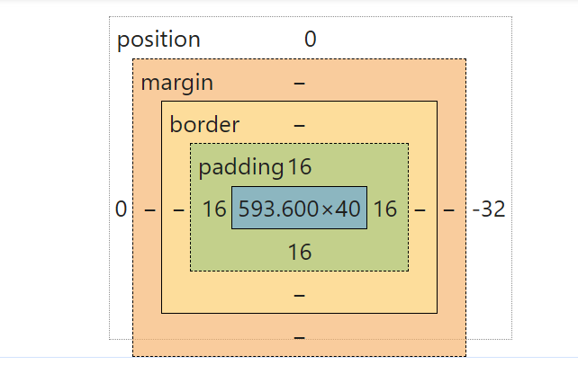
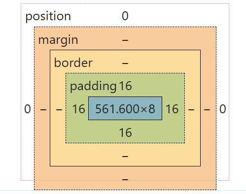

# CSS盒子模型问题

## 顶部导航栏圆角设置不全

#### 问题：在设置顶部导航栏时，设置了圆角，但是发现圆角设置不全，只有左边和上边有圆角，右边和下边没有圆角。并且，出现了迷之position为32。我在padding中设置了1rem（1rem=16px），position设置为fixed，width为100%，height为2.5rem。

- 解决：
    - 设置box-sizing:border-box后，发现导航栏的圆角显示出来，并且高度发生了改变。
    
    - 所以之前内元素溢出的原因就是：
        - 设置了 width:100%; 此时的 内容宽度 已经等于外元素的宽度，即 100rem(假设)。
        - 因为设置了 padding: 1rem;，所以此时内元素的实际宽度为 100rem + 1rem + 1rem = 102rem，比外元素 100rem 的宽度超出了 2rem，所以就溢出了。
    - box-sizing
        - box-sizing 是用来定义如何计算元素的宽度和高度，属性值如下：
        - box-sizing: content-box; 这是默认值，标准盒子模型。width 与 height 只包括内容的宽和高， 不包括边框（border），内边距（padding），外边距（margin）。
        - box-sizing: border-box; width 和 height 属性包括内容，内边距和边框，但不包括外边距。
        - 所以用 box-sizing: border-box; 就可以解决内元素宽度为100%时超出外元素的问题了。
#### 参考资料
- [内元素宽度设为100%为什么会超出外元素_width100%会突出去-CSDN博客](https://blog.csdn.net/sinat_35538827/article/details/109062694)