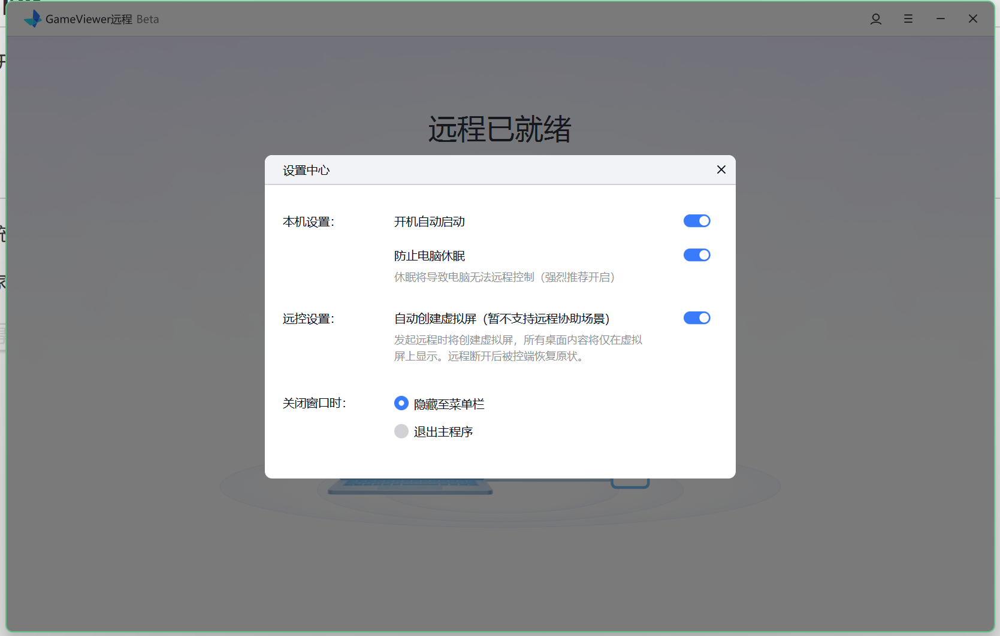

# GameViewer实现远程电脑

## GameViewer介绍

 GameViewer是由网易开发的一款全平台（有望鸿蒙Next）远程控制软件，特性：免费（可能暂时）、P2P、延迟低、界面美观、操作简易。

替代品：moonlight

## 实现

只需上[官网](https://gv.163.com)下载对应系统的软件，使用同一个手机号登录即可。

- 场景一：寒暑假在家，使用平板远程连接电脑（在校）
  - 电脑远程开机：
    - 首先，电脑得开启GameViewer开机自启。在电脑端右上角打开设置中心，开启下图中本机设置两个选项。
    - 然后，实现远程开机。
      1. 使用智能插座，如小米智能插座，将电脑的电源线通过智能插座通电。
      2. 进入主板BIOS界面设置电源通电就自动开机，即开启 AC recovery 设置。（不同主板的BIOS界面进入方式不同，可自行Bing搜索）
      3. 通过智能插座对应的APP相应操作即可实现远程开机。
